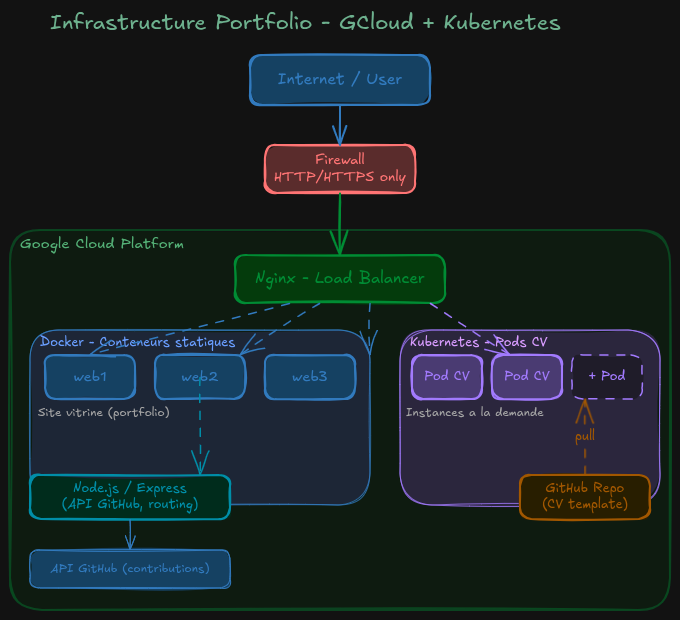

# Portfolio — enzo-granana.com (v2)

Site portfolio personnel hébergé sur Google Cloud, combinant un site vitrine statique servi par Docker et un mécanisme de CV interactif à la demande basé sur Kubernetes (K3s).

## Architecture



L'infrastructure repose sur une VM Google Cloud Platform (2 vCPU, 4 GiB RAM, Debian 12) qui héberge à la fois le site vitrine et un cluster K3s mono-noeud. Le trafic entrant est filtré par un pare-feu (UFW + GCP firewall) qui n'autorise que les ports 22, 80 et 443. Traefik (embarqué dans K3s) fait office de Load Balancer et termine le TLS via cert-manager + Let's Encrypt.

### Vue d'ensemble

| Composant | Rôle |
| --- | --- |
| **GCP Compute Engine** | VM unique qui héberge l'ensemble de la stack |
| **UFW + GCP Firewall** | Filtrage HTTP/HTTPS uniquement |
| **Traefik (K3s ingress)** | Load balancer + reverse proxy + redirection HTTPS |
| **cert-manager** | Génération et renouvellement automatique des certificats Let's Encrypt |
| **K3s** | Distribution Kubernetes légère, mono-noeud |
| **Deployment `website`** | 3 pods Node.js/Express servant le site vitrine |
| **Jobs `resume-*`** | Pods éphémères servant le CV conteneurisé, créés à la demande |

## Stack technique

- **Backend** : Node.js 18 + Express 5
- **Templating** : EJS
- **Orchestration** : K3s (Kubernetes)
- **Conteneurisation** : Docker
- **Reverse proxy / TLS** : Traefik + cert-manager + Let's Encrypt
- **Hébergement** : Google Cloud Platform (Compute Engine)
- **Domaine** : `enzo-granana.com`

## Structure du projet

```
.
├── server.js                  # Point d'entrée Express
├── dockerfile                 # Image du site vitrine
├── docker-compose.yml         # Build local
├── package.json
│
├── src/
│   ├── github.js              # Client API GitHub (contributions)
│   └── kubernetes.js          # Client K8s — création/suppression des pods CV
│
├── views/                     # Templates EJS
│   ├── index.ejs
│   ├── projects.ejs
│   └── contact.ejs
│
├── static/                    # Assets statiques
│   ├── components/            # Composants EJS partagés (navbar, etc.)
│   ├── css/                   # Feuilles de style
│   ├── files/                 # Fichiers pour le site
│   ├── images/                # Images du site
│   └── scripts/               # Scripts front-end
│
├── resume/                    # Image dédiée du CV conteneurisé
│   ├── dockerfile             # nginx:alpine + fichiers statiques
│   ├── index.html
│   ├── style.css
│   └── resume.pdf
│
├── kubernetes/                # Manifests Kubernetes
│   ├── deployment.yaml        # Deployment `website` + ServiceAccount + RBAC
│   ├── service.yaml           # Service LoadBalancer port 80 → 3030
│   └── networking.yaml        # Ingress, TLS, redirection HTTPS
│
└── infra/                     # Scripts pour l'infra IaC
    ├── setup.sh               # Setup complet du serveur sur VM (IaC)
    ├── deployment.sh          # Redéploiement après git pull
    └── launch.sh              # Déploiement initial
```

## Routes Express

| Méthode | Route | Description |
| --- | --- | --- |
| `GET` | `/` | Page d'accueil (rendu EJS `index`) |
| `GET` | `/projects` | Liste des projets |
| `GET` | `/contact` | Page de contact |
| `GET` | `/api/github` | Contributions GitHub |
| `GET` | `/cv/pdf` | CV au format PDF statique (fallback) |
| `POST` | `/api/cv/start` | Crée un pod CV éphémère (refus si ≥ 15 pods actifs) |
| `DELETE` | `/api/cv/:podName` | Supprime un pod CV |
| `*` | `/cv/:sessionId/*` | Proxy transparent vers le pod CV correspondant |

## Kubernetes

### Noeud unique

Un seul noeud K3s tourne sur la VM GCP. Capacité utile : ~2000m CPU et ~1.9 GiB RAM allouables aux pods (après réservation OS + kubelet).

### Deployment `website`

3 réplicas du site Node.js, exposés via un Service `LoadBalancer` (port 80 → 3030). Chaque pod réserve 50m CPU / 64 MiB RAM et peut grimper jusqu'à 200m CPU / 128 MiB RAM. Un ServiceAccount dédié (`website`) reçoit via RBAC le droit de lister les pods et créer/supprimer des Jobs dans le namespace.

### CV à la demande (Jobs Kubernetes)

Lorsqu'un visiteur clique sur le bouton "CV interactif" :

1. Le front appelle `POST /api/cv/start`
2. `src/kubernetes.js#CountResumePods` vérifie qu'il y a < 15 pods `app=resume` actifs (sinon redirection vers le PDF statique)
3. `CreateJob` crée un Job Kubernetes nommé `resume-<sessionId>` :
   - Image `resume:latest` (nginx:alpine servant 3 fichiers statiques)
   - `activeDeadlineSeconds: 300` (auto-destruction au bout de 5 min)
   - `ttlSecondsAfterFinished: 0` (nettoyage immédiat après fin)
   - `backoffLimit: 0` (pas de retry)
4. Le serveur attend que le pod soit `Running` et récupère son IP cluster
5. Le client est redirigé vers `/cv/<sessionId>/`
6. Toute requête sous ce préfixe est proxifiée vers `http://<podIP>:80` via `http-proxy-middleware`

La limite de 15 pods simultanés protège la RAM du noeud : à ~75 MiB par pod nginx, on plafonne à ~1.1 GiB pour cet usage, laissant la marge nécessaire au reste du cluster.

## Réseau et TLS

- **Ingress Traefik** route `enzo-granana.com` et `www.enzo-granana.com` vers le Service `website`
- **cert-manager** émet et renouvelle les certificats Let's Encrypt automatiquement via le challenge HTTP-01
- Une **Middleware Traefik** force la redirection HTTP → HTTPS

## Déploiement

### Provisionnement initial

Sur une VM GCP neuve :

```bash
git clone <repo> && cd website
sudo bash infra/setup.sh
```

Le script installe Docker, K3s, configure UFW, build l'image, l'importe dans containerd et applique les manifestes Kubernetes.

### Mise à jour

```bash
sudo bash infra/deployment.sh
```

Pull les changements, rebuild l'image, recharge les manifestes et attend que cert-manager soit prêt avant de réappliquer l'Ingress.

## Variables d'environnement

| Variable | Usage |
| --- | --- |
| `GITHUB_TOKEN` | Token d'accès à l'API GitHub (lecture publique). Monté dans le pod via le secret K8s `website` |
